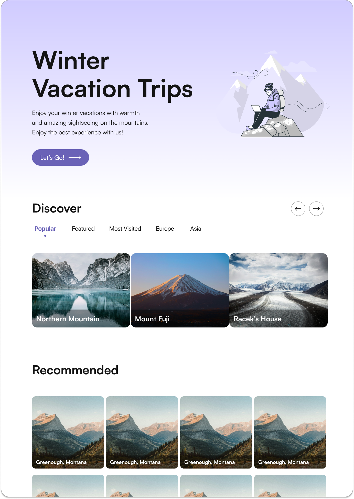
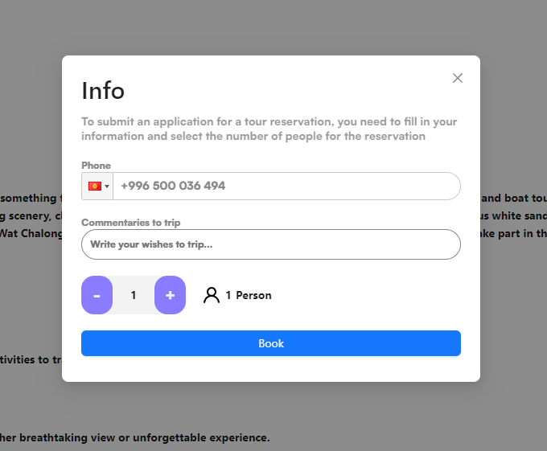

<h1>NeoTour</h1>

<h2>Описание проекта "Neo Tour"</h2>

Проект "Neo Tour" - это веб-приложение для поиска туров и бронирования путешествий. Цель проекта - предоставить пользователям удобный инструмент для выбора и планирования путешествий, а также обмена опытом и отзывами о посещенных местах.

Проект был разработан совместно командой из двух - фронтенд и бэкенд разработчика.

<h2>Особенности и функциональности</h2>

<h4>Главная страница</h4>

На главной странице пользователи могут ознакомиться с доступными турами и категориями путешествий. Основные особенности этой страницы:

    Интерактивная карусель с турами различных категорий.
    Подробное описание категорий и рекомендованных туров.
    Возможность плавного прокручивания страницы к списку туров при нажатии на кнопку "Choose a tour!".

<h4>Детальный экран тура</h4>

Детальная страница тура предоставляет пользователю более подробную информацию о выбранном путешествии и позволяет оформить бронь.

<h4>Модальное окно для отправки заявки</h4>

Пользователь при нажатии кнопки "Book Now" открывает модальное окно для указания информации о бронировании. Особенности модального окна:

    Автозаполнение кода страны (+996) с возможностью изменения.
    Валидация поля для ввода номера телефона.
    Возможность отправить заявку на бронирование тура.

<h2>Технологии</h2>

Проект разработан с использованием следующих технологий:

    Фронтенд: HTML, CSS, TypeScript, React.ts
    Бэкенд: Java (с использованием фреймворка Spring)
    Документация API: Swagger

<h2>Демо</h2>

<h4>Посмотреть демонстрацию</h4> https://erlankg0.github.io/neo-tour/

<h2>Contact</h2>

Telegram
@erlanbey
E mail era.ab.02@gmail.com, era.ab.2001@gmail.com
Backend 
<git>https://github.com/akzhol773</git>
